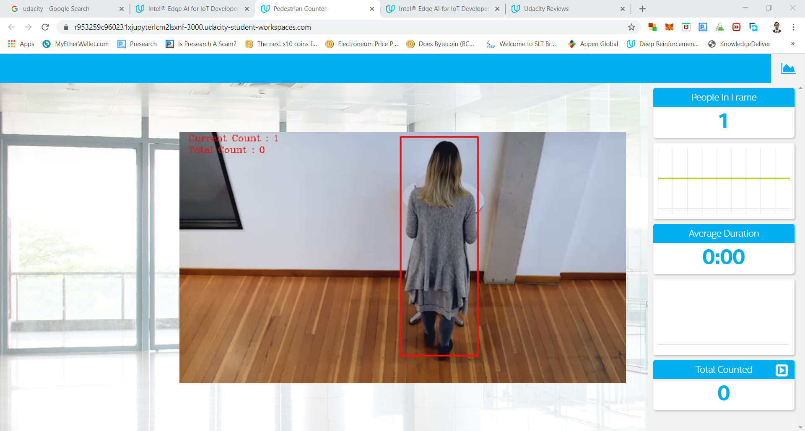
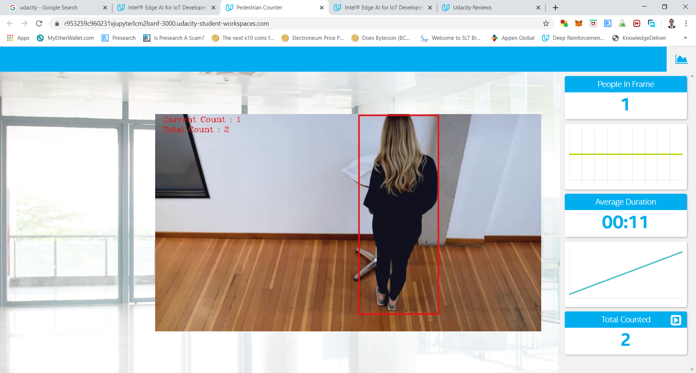
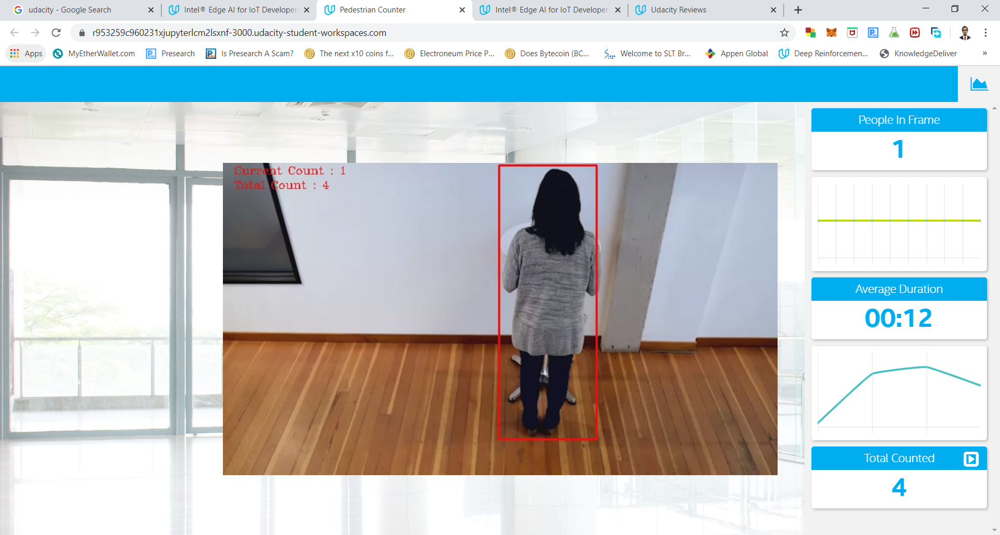
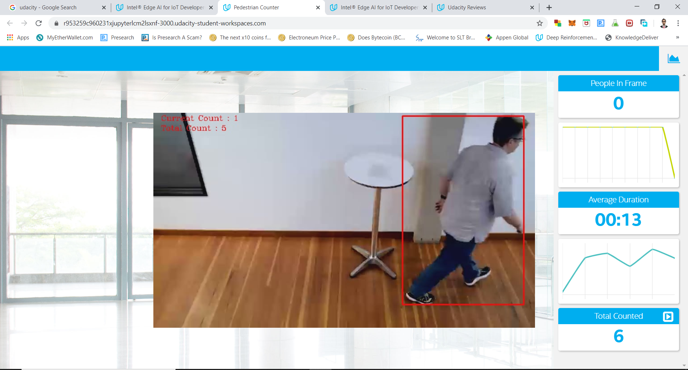
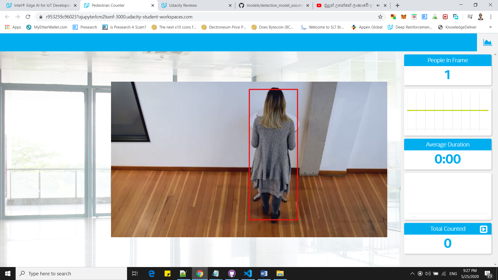
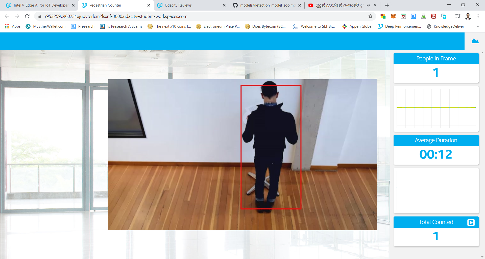
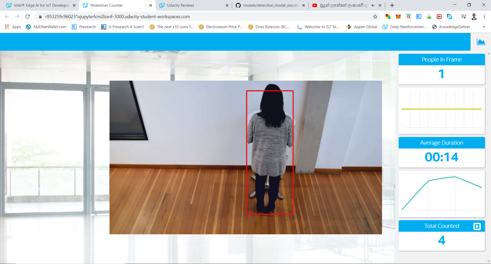
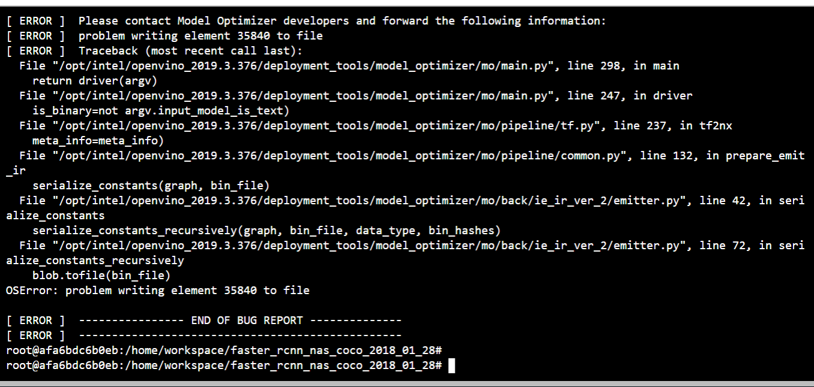
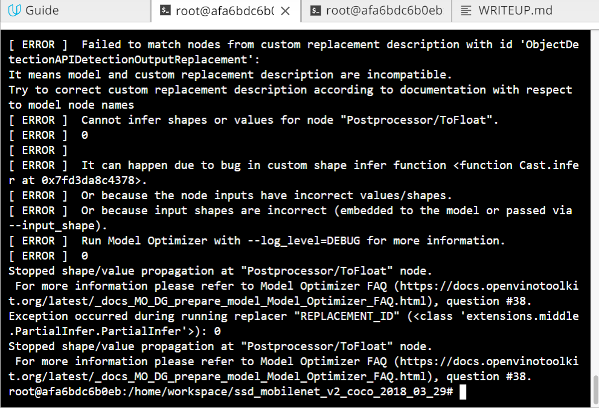

# Project Write-Up

You can use this document as a template for providing your project write-up. However, if you
have a different format you prefer, feel free to use it as long as you answer all required
questions.

## Explaining Custom Layers

Custom layers are layers that are not included in the list of known layers. If the topology contains any layers that are not in the list of known layers, the Model Optimizer classifies them as custom.
The Model Optimizer searches the list of known layers for each layer contained in the input model topology before building the model's internal representation, optimizing the model, and producing the Intermediate Representation files.
The Inference Engine loads the layers from the input model IR files into the specified device plugin, which will search a list of known layer implementations for the device. If the topology contains layers that are not in the list of known layers for the device, the Inference Engine considers the layer to be unsupported and reports an error

## Comparing Model Performance

In my case, I have downloaded several models from the TensorFlow Object Detection Model Zoo. Some models successfully converted into IR format but some are not correctly converted to IR with the Model Optimizer because during the converting process, there are some errors. Other problem I faced is that how to illustrate result after load some specific model into Inference Engine. 

So I have to focus my attention to 3 model that give me some trustable result when I use that model with OpenVino tool kit. 

I will explain here the step by step to how I convert “ssd_mobilenet_v2_coco_2018_03_29” model so that it can use with OpenVino tool kit.
You can go to TensorFlow Object Detection Model Zoo using following link.
https://github.com/tensorflow/models/blob/master/research/object_detection/g3doc/detection_model_zoo.md

In there you can see and download lot of pre trained models that can use for object detection. In my case I tried following models.

* ssd_mobilenet_v2_coco_2018_03_29 - Gives good result but sometime this model could not detect human continuously.
* ssd_mobilenet_v1_coco_2018_01_28 - Gives good result but sometime this model could not detect human continuously .
* faster_rcnn_inception_v2_coco - Gives accurate result but it was really slow when processing
* faster_rcnn_nas - Could not convert into IR format
* ssdlite_mobilenet_v2_coco - Could not convert into IR format


Finally I choose ssd_mobilenet_v2_coco_2018_03_29 model because it gives good result when convert into IR format with model optimizer.
To download and convert into IR format, I used following steps

Command to download model.
```
wget http://download.tensorflow.org/models/object_detection/ssd_mobilenet_v2_coco_2018_03_29.tar.gz
```

Then extracted using following command.
```
tar -xvf ssd_mobilenet_v2_coco_2018_03_29.tar.gz
```

Then go to extracted folder.
```
cd ssd_mobilenet_v2_coco_2018_03_29
```

Command to convert tensor flow model to IR format using model optimizer.
```
python /opt/intel/openvino/deployment_tools/model_optimizer/mo.py --input_model frozen_inference_graph.pb --tensorflow_object_detection_api_pipeline_config pipeline.config --reverse_input_channels --tensorflow_use_custom_operations_config /opt/intel/openvino/deployment_tools/model_optimizer/extensions/front/tf/ssd_v2_support.json
```
run the program
```
python main.py -i resources/Pedestrian_Detect_2_1_1.mp4 -m ssd_mobilenet_v2_coco_2018_03_29/frozen_inference_graph.xml -l /opt/intel/openvino/deployment_tools/inference_engine/lib/intel64/libcpu_extension_sse4.so -d CPU -pt 0.4 | ffmpeg -v warning -f rawvideo -pixel_format bgr24 -video_size 768x432 -framerate 24 -i - http://0.0.0.0:3004/fac.ffm
```

- Result images are following
    
    
    
    

-When compare this "ssd_mobilenet_v2_coco_2018_03_29" with and without openvino kit,
  * Accuracy is somewhat go down with openvino kit, because this model could not detect human continuously in each frame after convert      into IR format. But it does not affect lot for me, because I was able to handle it programmatically for this task.
  * The size of the model is almost same after convert into IR format. frozen_inference_graph.bin is about 65.697MB and                     frozen_inference_graph.pb is aabout 68.055MB.   
  * When using this model with openvino kit, it processing speed was really good and it could able to process and send frame and other      data to server side efficiently.
  * When convert model into IR format, the Preprocessor block has been removed. Only nodes performing mean value subtraction and scaling    (if applicable) are kept.
  * Model optimizer does not take lot of time to convert this model into IR format. Total execution time: 64.16 seconds.


## Assess Model Use Cases

* Count the number of people who attend to office as an attendance system. In office environment, Upper management may need to check how many people are existing in a different place such as meeting room... Etc. If we need to control A/C condition based on human count, this kind of model can be used.
* Count the number of people of a large building such as airport / train station / bus station. We may need to classify number of people come to building, number of people go out from building, count the number of people come in/out in a specific time zone....etc. Depending on the user case, statics requirement can be vary. Controlling A/C, Lighting, security system, automatic food machines...etc. are common systems that are used in the airport / train station / bus station. This models is very useful to build that kind of systems.
* Controling the traffic light based on the people count and vehicle count of a road junction. If there are lot of people are waiting to cross the road, we can allocate give enough time based on people could and also if there are small people count available, we can cut some time of crossing time and give that extra time to vehicle. This kind of system with save unnecessary time waiting and increase efficiency of the junction
* As a security system. We may need to control visiting human in a particular area. Then we can warn sound when human detect in the danger area such as animal zoo, Army camp.

## Assess Effects on End User Needs

- By reading the documentation of pre trained model, we may can get required information such as accuracy, speed, and output. 

- By applying that particular model for application and check the accuracy for different user cases.

## Model Research

[This heading is only required if a suitable model was not found after trying out at least three
different models. However, you may also use this heading to detail how you converted 
a successful model.]

In investigating potential people counter models, I tried each of the following three models:

- Model 1: [ssd_mobilenet_v2_coco]
  - [Model Source] 
    ```
    https://github.com/tensorflow/models/blob/master/research/object_detection/g3doc/detection_model_zoo.md
    ```
  - I converted the model to an Intermediate Representation with the following arguments...

  - Command to download model.
    ```
    wget http://download.tensorflow.org/models/object_detection/ssd_mobilenet_v2_coco_2018_03_29.tar.gz
    ```

  - Then extracted using following command.
    ```
    tar -xvf ssd_mobilenet_v2_coco_2018_03_29.tar.gz
    ```

  - Then go to extracted folder.
    ```
    cd ssd_mobilenet_v2_coco_2018_03_29
    ```

  - Command to convert tensor flow model to IR format using model optimizer.
    ```
    python /opt/intel/openvino/deployment_tools/model_optimizer/mo.py --input_model frozen_inference_graph.pb --tensorflow_object_detection_api_pipeline_config pipeline.config --reverse_input_channels --tensorflow_use_custom_operations_config /opt/intel/openvino/deployment_tools/model_optimizer/extensions/front/tf/ssd_v2_support.json
    ```
  - I was able to convert this model into IR format succefully and generate .xml and .bin file.

  - Result images are following
    
    
    
    

- Model 2: [ssd_mobilenet_v1_coco]
  - [Model Source] 
    ```
    https://github.com/tensorflow/models/blob/master/research/object_detection/g3doc/detection_model_zoo.md
    ```
  - I converted the model to an Intermediate Representation with the following arguments...

    Command to download model.
    ```
    wget http://download.tensorflow.org/models/object_detection/ssd_mobilenet_v1_coco_2018_01_28.tar.gz
    ```

    Then extracted using following command.
    ```
    tar -xvf ssd_mobilenet_v1_coco_2018_01_28.tar.gz
    ```

    Then go to extracted folder.
    ```
    cd ssd_mobilenet_v1_coco_2018_01_28
    ```

    Command to convert tensor flow model to IR format using model optimizer.
    ```
    python /opt/intel/openvino/deployment_tools/model_optimizer/mo.py --input_model frozen_inference_graph.pb --tensorflow_object_detection_api_pipeline_config pipeline.config --reverse_input_channels --tensorflow_use_custom_operations_config /opt/intel/openvino/deployment_tools/model_optimizer/extensions/front/tf/ssd_v2_support.json
    ```

  - I was able to convert this model into IR format succefully and generate .xml and .bin file.

- Model 3: [faster_rcnn_inception_v2_coco]
  - [Model Source] 
    ```
    https://github.com/tensorflow/models/blob/master/research/object_detection/g3doc/detection_model_zoo.md
    ```
  - I converted the model to an Intermediate Representation with the following arguments...

    Command to download model.
    ```
    wget http://download.tensorflow.org/models/object_detection/faster_rcnn_inception_v2_coco_2018_01_28.tar.gz
    ```

    Then extracted using following command.
    ```
    tar -xvf faster_rcnn_inception_v2_coco_2018_01_28.tar.gz
    ```

    Then go to extracted folder.
    ```
    cd faster_rcnn_inception_v2_coco_2018_01_28
    ```

    Command to convert tensor flow model to IR format using model optimizer.
    ```
    python /opt/intel/openvino/deployment_tools/model_optimizer/mo.py --input_model frozen_inference_graph.pb --tensorflow_object_detection_api_pipeline_config pipeline.config --reverse_input_channels --tensorflow_use_custom_operations_config /opt/intel/openvino/deployment_tools/model_optimizer/extensions/front/tf/faster_rcnn_support.json
    ```

  - I was able to convert this model into IR format succefully and generate .xml and .bin file.

  - Result images are following
    
    
    
    
  
- Model 4: [ssd_mobilenet_v1_coco]
  - [Model Source] 
    ```
    https://github.com/tensorflow/models/blob/master/research/object_detection/g3doc/detection_model_zoo.md
    ```
  - I converted the model to an Intermediate Representation with the following arguments...

    Command to download model.
    ```
    wget http://download.tensorflow.org/models/object_detection/faster_rcnn_nas_coco_2018_01_28.tar.gz
    ```

    Then extracted using following command.
    ```
    tar -xvf faster_rcnn_nas_coco_2018_01_28.tar.gz
    ```

    Then go to extracted folder.
    ```
    cd faster_rcnn_nas_coco_2018_01_28
    ```

    Command to convert tensor flow model to IR format using model optimizer.
    ```
    python /opt/intel/openvino/deployment_tools/model_optimizer/mo.py --input_model frozen_inference_graph.pb --tensorflow_object_detection_api_pipeline_config pipeline.config --reverse_input_channels --tensorflow_use_custom_operations_config /opt/intel/openvino/deployment_tools/model_optimizer/extensions/front/tf/faster_rcnn_support.json
    ```

    - Could not converted into IR format properly.
    

- Model 5: [ssd_mobilenet_v2_coco]
  - [Model Source] 
    ```
    https://github.com/tensorflow/models/blob/master/research/object_detection/g3doc/detection_model_zoo.md
    ```
  - I converted the model to an Intermediate Representation with the following arguments...

    Command to download model.
    ```
    wget http://download.tensorflow.org/models/object_detection/ssd_mobilenet_v2_coco_2018_03_29.tar.gz
    ```

    Then extracted using following command.
    ```
    tar -xvf ssd_mobilenet_v2_coco_2018_03_29.tar.gz
    ```

    Then go to extracted folder.
    ```
    cd ssd_mobilenet_v2_coco_2018_03_29
    ```

    Command to convert tensor flow model to IR format using model optimizer.
    ```
    python /opt/intel/openvino/deployment_tools/model_optimizer/mo.py --input_model frozen_inference_graph.pb --tensorflow_object_detection_api_pipeline_config pipeline.config --reverse_input_channels --tensorflow_use_custom_operations_config /opt/intel/openvino/deployment_tools/model_optimizer/extensions/front/tf/faster_rcnn_support.json
    ```
    - Could not converted into IR format properly.
    